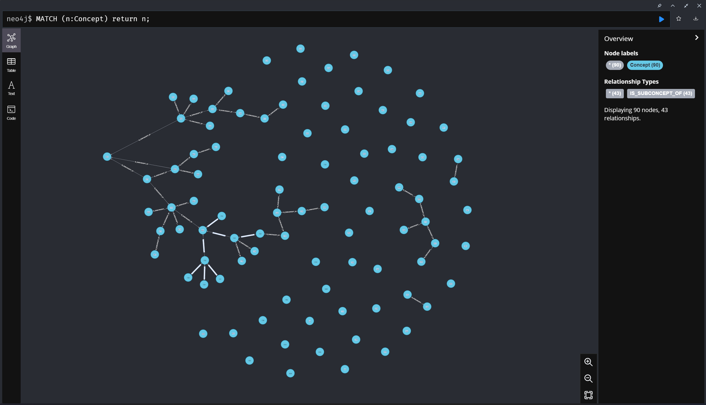

# Command to add example data to database

Run in a terminal:
```bash
# Go to the good repository
cd TobGraphServer

# Download the last current.json from BoK
curl https://eo4geo-uji-backup.firebaseio.com/current.json ./data/current.json

# Transform current.json -> CSV
node data/JsonToCsv.js

# Copy the CSV files to the import repository of Neo4j
data/cpneo.sh
```

Then you can run the cypher shell:
```bash
cypher-shell
```
Connect and run the following commands:
Entire file at the footer of this page.

```bash
# LOAD CONCEPTS
LOAD CSV WITH HEADERS FROM 'file:///concept.csv' AS row
WITH row WHERE row.Id IS NOT NULL
MERGE (c:Concept {id: row.Id, code: row.Code, name: row.Name, description: row.Description, category: row.Category});

# LOAD CONTRIBUTORS
LOAD CSV WITH HEADERS FROM 'file:///contributor.csv' AS row
WITH row WHERE row.Id IS NOT NULL
MERGE (b:Contributor {id: row.Id, name: row.Name, description: row.Description, url: row.Url})
WITH b, row
UNWIND split(row.Concepts, ':') AS idconcept
MATCH (c:Concept {id: idconcept})
MERGE (b)-[r:CONTRIBUTED]->(c);

# LOAD REFERENCES
LOAD CSV WITH HEADERS FROM 'file:///reference.csv' AS row
WITH row WHERE row.Id IS NOT NULL
MERGE (f:Reference {id: row.Id, name: row.Name, description: row.Description, url: row.Url})
WITH f, row
UNWIND split(row.Concepts, ':') AS idconcept
MATCH (c:Concept {id: idconcept})
MERGE (f)-[r:REFER_TO]->(c);

# MAKE RELATION IS_SUBCONCEPT OF
LOAD CSV WITH HEADERS FROM 'file:///relation.csv' AS row
WITH row WHERE row.Id IS NOT NULL AND row.Name = "IS_SUBCONCEPT_OF"
MATCH(s:Concept {id: row.Source})
MATCH(t:Concept {id: row.Target})
MERGE (s)-[r:IS_SUBCONCEPT_TEMP_OF]->(t);

# MAKE RELATION IS_SUBCONCEPT OF
LOAD CSV WITH HEADERS FROM 'file:///relation.csv' AS row
WITH row WHERE row.Id IS NOT NULL AND row.Name = "IS_PREREQUISITE_OF"
MATCH(s:Concept {id: row.Source})
MATCH(t:Concept {id: row.Target})
MERGE (s)-[r:IS_PREREQUISITE_OF]->(t);

# MAKE RELATION IS_SUBCONCEPT OF
LOAD CSV WITH HEADERS FROM 'file:///relation.csv' AS row
WITH row WHERE row.Id IS NOT NULL AND row.Name = "IS_SIMILAR_TO"
MATCH(s:Concept {id: row.Source})
MATCH(t:Concept {id: row.Target})
MERGE (s)<-[r:IS_SIMILAR]->(t);

# LOAD SKILL
LOAD CSV WITH HEADERS FROM 'file:///skill.csv' AS row
WITH row WHERE row.Id IS NOT NULL
MERGE (s:Skill {id: row.Id, name: row.Name})
WITH s, row
UNWIND split(row.Concepts, ':') AS idconcept
MATCH (c:Concept {id: idconcept})
MERGE (c)-[r:NEED]->(s);

# EXTENDS RELATION BEETWEEN CONCEPTS
MATCH (a:Concept {category:"REMOTE SENSING"})-[:IS_SUBCONCEPT_TEMP_OF*2..]->(b:Concept{category:"REMOTE SENSING"})
MERGE (a)-[:IS_SUBCONCEPT_OF]->(b);

# DELETE CONCEPT WE DONT WANT
MATCH (c:Concept {category: "NONE}) DETACH DELETE c;
```



Reset database :

```bash
MATCH (n:Concept) DETACH DELETE n;
MATCH (n:Contributor) DETACH DELETE n;
MATCH (n:Reference) DETACH DELETE n;
MATCH (n:Skill) DETACH DELETE n;
LOAD CSV WITH HEADERS FROM 'file:///concept.csv' AS row
WITH row WHERE row.Id IS NOT NULL
MERGE (c:Concept {id: row.Id, code: row.Code, name: row.Name, description: row.Description, category: row.Category});
LOAD CSV WITH HEADERS FROM 'file:///contributor.csv' AS row
WITH row WHERE row.Id IS NOT NULL
MERGE (b:Contributor {id: row.Id, name: row.Name, description: row.Description, url: row.Url})
WITH b, row
UNWIND split(row.Concepts, ':') AS idconcept
MATCH (c:Concept {id: idconcept})
MERGE (b)-[r:CONTRIBUTED]->(c);
LOAD CSV WITH HEADERS FROM 'file:///reference.csv' AS row
WITH row WHERE row.Id IS NOT NULL
MERGE (f:Reference {id: row.Id, name: row.Name, description: row.Description, url: row.Url})
WITH f, row
UNWIND split(row.Concepts, ':') AS idconcept
MATCH (c:Concept {id: idconcept})
MERGE (f)-[r:REFER_TO]->(c);
LOAD CSV WITH HEADERS FROM 'file:///relation.csv' AS row
WITH row WHERE row.Id IS NOT NULL AND row.Name = "IS_SUBCONCEPT_OF"
MATCH(s:Concept {id: row.Source})
MATCH(t:Concept {id: row.Target})
MERGE (s)-[r:IS_SUBCONCEPT_TEMP_OF]->(t);
LOAD CSV WITH HEADERS FROM 'file:///relation.csv' AS row
WITH row WHERE row.Id IS NOT NULL AND row.Name = "IS_PREREQUISITE_OF"
MATCH(s:Concept {id: row.Source})
MATCH(t:Concept {id: row.Target})
MERGE (s)-[r:IS_PREREQUISITE_OF]->(t);
LOAD CSV WITH HEADERS FROM 'file:///relation.csv' AS row
WITH row WHERE row.Id IS NOT NULL AND row.Name = "IS_SIMILAR_TO"
MATCH(s:Concept {id: row.Source})
MATCH(t:Concept {id: row.Target})
MERGE (s)<-[r:IS_SIMILAR]->(t);
LOAD CSV WITH HEADERS FROM 'file:///skill.csv' AS row
WITH row WHERE row.Id IS NOT NULL
MERGE (s:Skill {id: row.Id, name: row.Name})
WITH s, row
UNWIND split(row.Concepts, ':') AS idconcept
MATCH (c:Concept {id: idconcept})
MERGE (c)-[r:NEED]->(s);
MATCH (a:Concept {category:"REMOTE SENSING"})-[:IS_SUBCONCEPT_TEMP_OF*2..]->(b:Concept{category:"REMOTE SENSING"})
MERGE (a)-[:IS_SUBCONCEPT_OF]->(b);
MATCH (c:Concept {category: "NONE"}) DETACH DELETE c;
```